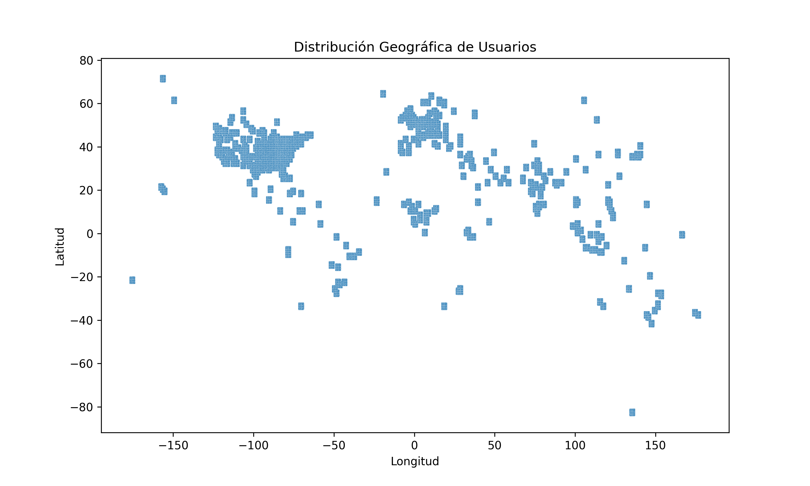

# PROYECTO ADA  
## Primera Revisión de Avance: Carga Masiva + EDA en Python (20 puntos)

**Integrantes:**  
- Huamani Vasquez Juan Jose  
- Zela Flores Gabriel Frank  

---

##  Objetivo del Proyecto

Analizar y visualizar la estructura del grafo de una red social compuesta por 10 millones de usuarios. El análisis busca descubrir patrones relevantes, comunidades y propiedades estructurales del grafo usando técnicas de preprocesamiento, visualización y análisis de redes.

---

##  Datos Utilizados

- `10_million_location.txt`: Contiene coordenadas (latitud, longitud) de cada usuario.
- `10_million_user.txt`: Contiene la lista de adyacencia (usuarios seguidos por cada nodo).

---

## Carga Masiva Eficiente

**Justificación:**  
El código utiliza la librería `polars` en modo `lazy` y `streaming`, que permite procesar 10 millones de registros sin cargarlos completamente en memoria, lo que es ideal para entornos de big data.

**Fragmento relevante del código:**
```python
locations_lazy = pl.scan_csv("...10_million_location.txt", ...)
users_lazy = pl.scan_csv("...10_million_user.txt", ...)
```

---

## Gestión de Recursos y Errores

**Justificación:**  
- Se usa `try-except` para capturar errores críticos.
- Uso de `logging` bien estructurado con niveles `INFO` y `EXCEPTION` para trazabilidad del proceso.
- Validación de coordenadas geográficas y limpieza de entradas irregulares.

**Fragmento relevante del código:**
```python
logging.basicConfig(...)  
try:
    ...
    locations_valid = locations_lazy.filter(...)
    ...
except Exception as e:
    log.exception(...)
```

---

---

## 📊 Análisis Exploratorio de Datos (EDA)

Esta fase se encargó de validar, analizar y visualizar los datos geográficos de los usuarios, con el objetivo de comprender su distribución espacial y detectar valores anómalos.

### Carga y Verificación
- Se cargaron los archivos `.parquet` procesados.
- Se confirmó que **no existen valores nulos** en latitud, longitud o conexiones.

### Estadísticas Descriptivas
Se generó un resumen estadístico de las coordenadas:

- Rango válido de latitud: entre -90 y 90 grados.
- Rango válido de longitud: entre -180 y 180 grados.
- Se identificaron valores extremos para ser tratados como posibles outliers.

### Detección de Outliers Geográficos
Se aplicó Z-score para detectar coordenadas anómalas:

- Se consideraron outliers aquellas ubicaciones con |z| > 3.
- Se encontraron múltiples valores fuera del patrón geográfico general.

**Gráfico generado:**  
Rename distribucion_outliers.png to GRAFICOS/distribucion_outliers.png

### Visualización de la Distribución General
Se generó un gráfico de dispersión que muestra la distribución de los usuarios sobre el espacio geográfico:

**Gráfico generado:**  


### Regiones con Mayor Concentración de Usuarios
Se agruparon las ubicaciones por bloques de 10 grados (binning) y se generó una tabla con las regiones más densamente pobladas:

```text
Top 10 regiones con más usuarios:
(lat_bin, lon_bin) | conteo
-------------------|--------
...                | ...
```

### Hallazgos Clave
- La mayoría de usuarios se concentran en unas pocas regiones del mundo.
- Los valores nulos fueron correctamente manejados en el preprocesamiento.
- Se identificaron y graficaron coordenadas geográficas atípicas para análisis futuro.
- La distribución sugiere potenciales hubs de conectividad en el grafo.

---


## Legibilidad y Calidad del Código

**Justificación:**  
- Código bien comentado, modularizado (función `main()`), y organizado por secciones.
- Claramente estructurado con mensajes de logging que indican cada paso.

**Ejemplo:**
```python
log.info("📍 Cargando ubicaciones en modo streaming (lazy)...")
```

---

## Documentación y Presentación

**Justificación:**  
Este `README.md` explica:
- Objetivo del proyecto.
- Detalles del dataset.
- Cómo el código cumple con cada criterio de evaluación.
- Qué fragmentos específicos respaldan los puntos evaluados.

---

## ▶ Ejecución del Script

### Requisitos
- Python 3.11
- `polars` (`pip install polars`)

### Ejecución
```bash
python preprocesamiento_red_social.py
```

### Salidas esperadas
- `ubicaciones_limpias.parquet`
- `usuarios_conexiones.parquet`

---

##  Archivos Clave

| Archivo | Descripción |
|--------|-------------|
| `preprocesamiento_red_social.py` | Código de carga masiva, validación y conversión a `.parquet`. |
| `ubicaciones_limpias.parquet` | Coordenadas válidas y limpias. |
| `usuarios_conexiones.parquet` | Conexiones por usuario en formato estructurado. |

---

##  Próximos Pasos
- Construcción del grafo con `networkx`.
- Cálculo de métricas: nodos, aristas, grado.
- Visualización de comunidades con algoritmos Louvain o Girvan-Newman.

---

##  Referencias

- [Polars Documentation](https://pola-rs.github.io/polars/)
- [Dataset: Red Social 'X'](https://drive.google.com/drive/folders/1XvzgZ3NKo3EruGOHDirM6bQwfc8fejpl?usp=sharing)
